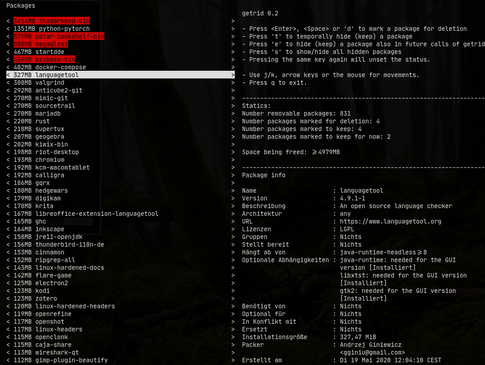

# `getrid` of arch packages you don't need anymore

Having a rolling release distribution if one of the big advantages of Arch
compared to other distributions: no outdated software nor being forced to do
lengthy and risky upgrades or fresh installs every X months/years.  The
downside of this is that there are never any "clear cuts" and the amounts of
packages once installed but not needed anymore constantly grows.

Removing old packages is annoying, so I wrote `getrid` a tool that makes it
easier to find packages that unnecessary fill up your disk. It's a simple
terminal user interface allows you to decide which packages to keep and which
to remove.

Dependencies: python, pacgraph, urwid

## How to use?
It list you all packages that can be removed (are not a dependency of other
packages), sorted by the disk space that would be freed if removed – this
includes dependencies that aren't needed of other packages and where not
installed explicit.

Go though the list and decide:
- If you definitely want to keep a package -> key `e`
- Want to keep them "for now" -> key `t`
- Want to get rid of it -> key `d`, `Space` or `Enter`

The first list is saved to disk, so you won't have to deal with them the next
time you start getrid. If you want to see the hidden entries press `s`.

